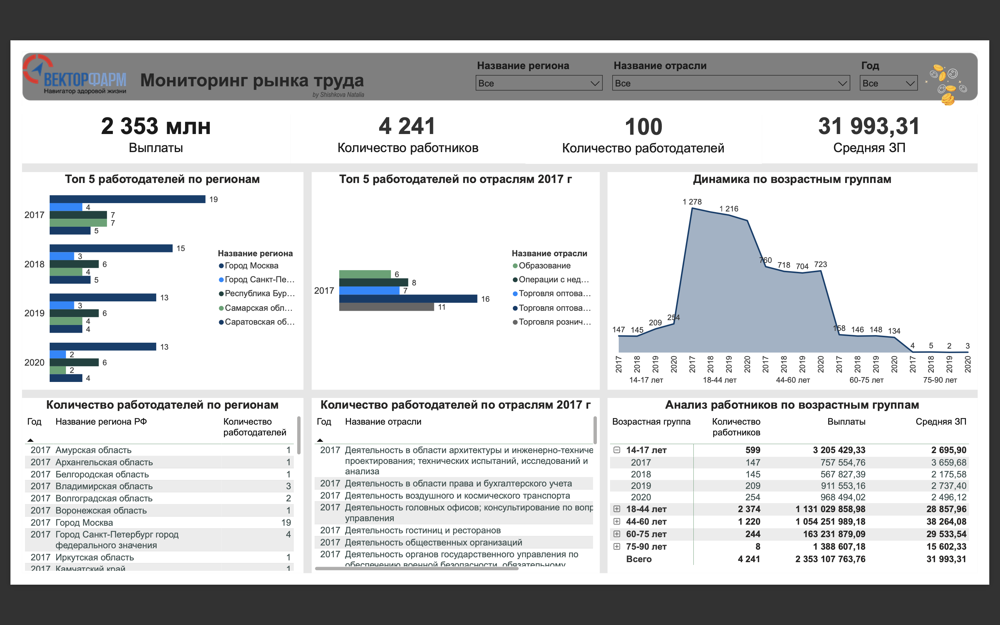
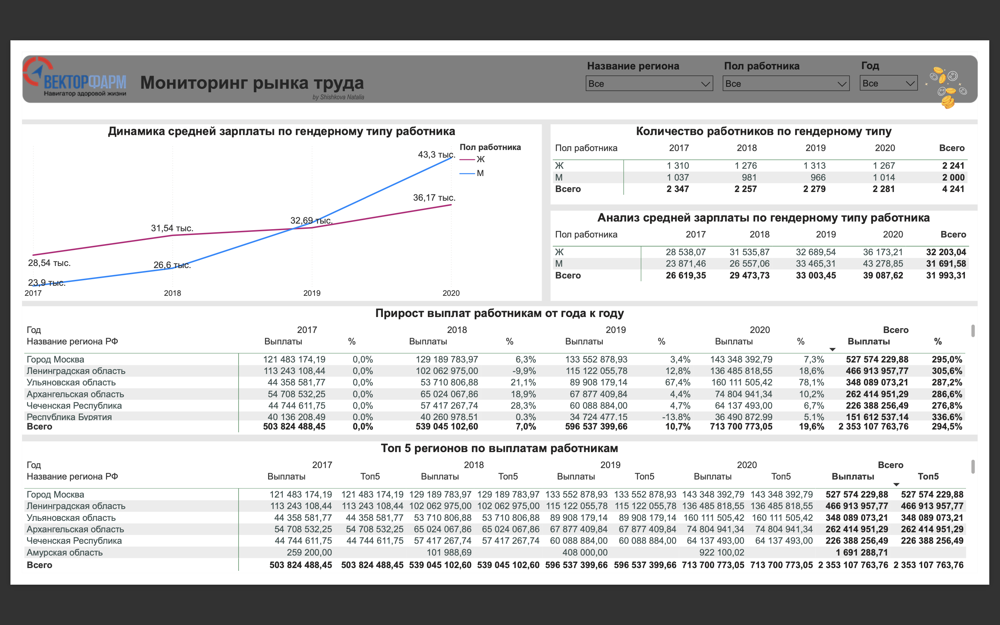

### Мониторинг рынка труда 

1. Цель проекта
   - Разработка и визуализация комплексной системы мониторинга рынка труда и кадровых метрик для оценки динамики фонда оплаты труда (ФОТ), анализа гендерных и возрастных различий в уровне заработных плат, а также выявления ключевых регионов и отраслей присутствия работодателей.
2. Стек технологий
   - Power BI Desktop
   - Power Query (M): Сбор данных из внешних источников, очистка текстовых полей, нормализация названий регионов и отраслей, группировка сотрудников по возрастным когортам.
   - DAX: Реализация продвинутых мер для расчета накопительных итогов, процентов прироста год к году (YoY), динамического ранжирования (Топ-5 с общим итогом).

3. Архитектура данных:
   - Реализована схема «Снежинка».
   - Интегрирован Master-календарь для сквозной аналитики показателей по годам (2017–2020) и динамических сдвигов дат.
   
4. Реализованный функционал.
   
Расчет кадровых и финансовых метрик (DAX). Созданы меры для ключевых KPI:
- Общий объем выплат (2 353 млн),
- Количество работников (4 241),
- Количество работодателей (100),
- Средняя заработная плата (31 993,31).
     
Гендерный и динамический анализ:
- Настроена интерактивная линейная диаграмма, отражающая динамику средней зарплаты по гендерному типу, и матрицы для сравнения численности сотрудников (Ж/М).
     
Сложное ранжирование (Top-N):
- Написана логика расчета «Топ-5 регионов по выплатам с общим итогом», позволяющая видеть лидеров и общую сумму затрат в одной таблице без искажения строки «Всего».
   
Когортный и отраслевой анализ:
- Сформирована матрица анализа сотрудников по возрастным группам (14–17, 18–44, 44–60, 60–75, 75–90 лет) и настроены интерактивные диаграммы топ-5 отраслей и регионов.
  
5. Аналитический отчет
   - Общее состояние и динамика: За период 2017–2020 гг. общий объем выплат вырос на 294,5% (до 2 353 млн руб.).
   - Средняя заработная плата по рынку составила 31 993,31 руб. Наблюдается стабильный ежегодный рост средних зарплат как у мужчин, так и у женщин.
   - Гендерный разрыв: Выявлен выраженный гендерный разрыв в уровне оплаты труда. Несмотря на то, что женщин в выборке больше (2 241 против 2 000 мужчин), средняя зарплата мужчин в 2020 году составила 43 278,85 руб., что на 34% выше средней зарплаты женщин за тот же период (32 203,04 руб.).
   - Географическая и возрастная сегментация: Абсолютным лидером по выплатам является Город Москва (527,5 млн руб.). Основным ядром рынка труда выступает возрастная группа от 18 до 44 лет (2 374 сотрудника), при этом наибольший уровень средней заработной платы зафиксирован в когорте 44–60 лет (38 264,08 руб.).
